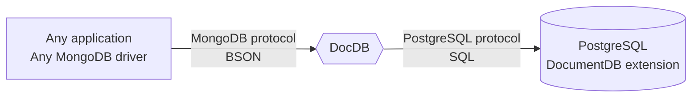

# DocDB

<!-- textlint-disable one-sentence-per-line -->

> [!TIP]
> Looking for DocDB v1?
> It is [there](https://github.com/hanzoai/docdb/tree/main-v1).

<!-- textlint-enable one-sentence-per-line -->

[](https://pkg.go.dev/github.com/hanzoai/docdb/v2/docdb)

[](https://github.com/hanzoai/docdb/actions/workflows/go.yml)
[](https://codecov.io/gh/hanzoai/documentdb)

[](https://github.com/hanzoai/docdb/actions/workflows/security.yml)
[](https://github.com/hanzoai/docdb/actions/workflows/packages.yml)
[](https://github.com/hanzoai/docdb/actions/workflows/docs.yml)

DocDB is an open-source alternative to MongoDB.
It is a proxy that converts MongoDB 5.0+ wire protocol queries to SQL
and uses PostgreSQL with [DocumentDB extension](https://github.com/documentdb/documentdb) as a database engine.



## Why do we need DocDB?

MongoDB was originally an eye-opening technology for many of us developers,
empowering us to build applications faster than using relational databases.
In its early days, its ease-to-use and well-documented drivers made MongoDB one of the simplest database solutions available.
However, as time passed, MongoDB abandoned its open-source roots;
changing the license to [SSPL](https://www.docdb.com/sspl) - making it unusable for many open-source and early-stage commercial projects.

Most MongoDB users do not require any advanced features offered by MongoDB;
however, they need an easy-to-use open-source document database solution.
Recognizing this, DocDB is here to fill that gap.

## Scope and current state

DocDB is compatible with MongoDB drivers and popular MongoDB tools.
It functions as a drop-in replacement for MongoDB 5.0+ in many cases.
Features are constantly being added to further increase compatibility and performance.

We welcome all contributors.
See our [public roadmap](https://github.com/orgs/DocDB/projects/2/views/1),
lists of [known differences and supported commands](https://docs.docdb.io/migration/compatibility/),
and [contributing guidelines](CONTRIBUTING.md).

## Quickstart

Run this command to start DocDB with PostgreSQL, make sure to update `<username>` and `<password>`:

```sh
docker run -d --rm --name docdb -p 27017:27017 \
  -e POSTGRES_USER=<username> \
  -e POSTGRES_PASSWORD=<password> \
  ghcr.io/hanzoai/docdb-eval:2
```

This command will start a container with DocDB, pre-packaged PostgreSQL with DocumentDB extension, and MongoDB Shell for quick testing and experiments.
However, it is unsuitable for production use cases because it keeps all data inside and loses it on shutdown.
See our [installation guides](https://docs.docdb.io/installation/) for instructions
that don't have those problems.

With that container running, you can:

- Connect to it with any MongoDB client application using the MongoDB URI `mongodb://<username>:<password>@127.0.0.1:27017/`.
- Connect to it using the MongoDB Shell by just running `mongosh`.
  If you don't have it installed locally, you can run `docker exec -it docdb mongosh`.
- For PostgreSQL, connect to it by running `docker exec -it docdb psql -U <username> postgres`.

You can stop the container with `docker stop docdb`.

We also provide binaries and packages for various Linux distributions.
as well as [Go library package](https://pkg.go.dev/github.com/hanzoai/docdb/v2/docdb)
that embeds DocDB into your application.
See [our documentation](https://docs.docdb.io/installation/) for more details.

## Building and packaging

<!-- textlint-disable one-sentence-per-line -->

> [!NOTE]
> We advise users not to build DocDB themselves.
> Instead, use binaries, Docker images, or packages provided by us.

<!-- textlint-enable one-sentence-per-line -->

DocDB could be built as any other Go program,
but a few generated files and build tags could affect it.
See [there](https://pkg.go.dev/github.com/hanzoai/docdb/v2/build/version) for more details.

## Managed DocDB at cloud providers

- [DocDB Cloud](https://cloud.docdb.com/)
- [Civo](https://www.civo.com/marketplace/DocDB)
- [Tembo](https://tembo.io/docs/tembo-stacks/mongo-alternative)
- [Elestio](https://elest.io/open-source/docdb)
- [Cozystack](https://cozystack.io/docs/components/#managed-docdb)

## Community

- Website: https://www.docdb.com/.
- Blog: https://blog.docdb.io/.
- Documentation: https://docs.docdb.io/.
- X (Twitter): [@hanzo_docdb](https://x.com/hanzo_docdb).
- Mastodon: [@docdb@techhub.social](https://techhub.social/@docdb).
- [Slack chat](https://slack.docdb.io/) for quick questions.
- [GitHub Discussions](https://github.com/hanzoai/docdb/discussions) for longer topics.
- [GitHub Issues](https://github.com/hanzoai/docdb/issues) for bugs and missing features.

If you want to contact DocDB Inc., please use [this form](https://www.docdb.com/contact/).
